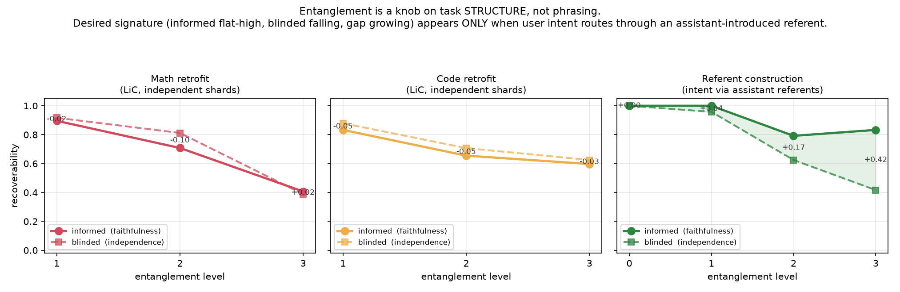
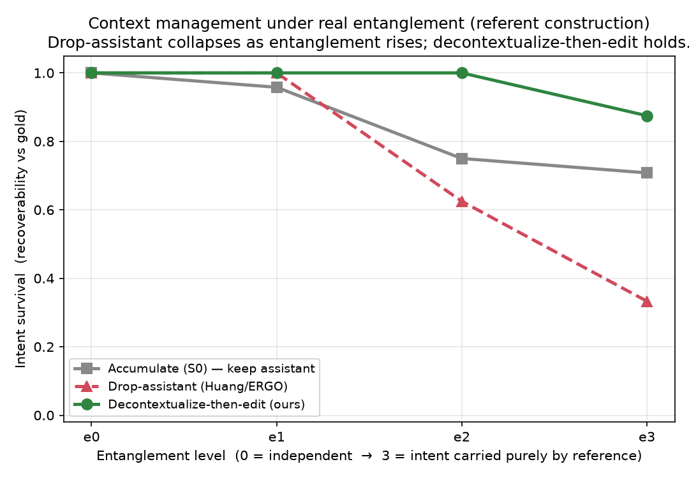

# Entanglement as a controllable knob: what it takes, and what it actually requires

**Status:** research note from an autonomous overnight build (2026-07-30).
**Origin:** Philippe's proposal in `neurips_review/philippe_discusion.md`.
**Artifacts:** `research/entanglement/` (code, worklog, raw metrics, figures).

## 1. The proposal

Our published work argues that LLMs *lose the plot* over multi-turn conversations and that you
can recover much of the single-turn performance by **editing the context** — surgically removing
the assistant's own erroneous, over-committed reasoning rather than accumulating it. A natural
skeptical question: *why not just delete all assistant messages?* That is the Huang et al. / ERGO
move, and it sometimes works. Philippe's insight is that whether it works depends on a hidden
variable we have never controlled: **entanglement** — the degree to which a user's turn depends on,
and refers back to, the assistant's prior response.

- **Entanglement = 0 (independent).** Every user turn is self-contained ("there are 3 more red
  marbles than blue"). This is exactly the *Lost in Conversation* (LiC) setup. You can delete all
  assistant messages *losslessly*, because no user turn points at them. Deleting assistant turns is
  a free win here — but this regime is unrealistic.
- **Entanglement = high.** User turns are phrased *relative* to the assistant ("no, reverse that",
  "use the value you got", "go with option B"). Delete the assistant turn and the user turn becomes
  uninterpretable. This is what real collaborative sessions look like.

Philippe's thesis, and the figure he wants: hold a single benchmark fixed, expose entanglement as
an explicit **knob**, and plot each context-management method as a line across entanglement levels.
The prediction: **(1)** drop-assistant only survives at low entanglement; **(2)** naive accumulation
pollutes everywhere; **(3)** a good method (decontextualize-then-edit) holds across *all* levels.

## 2. What we built

- **`EntanglementUserAgent`** (`src/ctx_editor/agents/entanglement_user_agent.py`) — a drop-in
  user simulator with an ordinal `entanglement_level` (0–3). Level 0 delegates to stock LiC. Levels
  1–3 rephrase the same shard with increasing reliance on the assistant's prior turn
  (light-anaphora → referential → relative-elliptical). Wired through Hydra
  (`config/user_mode/entangled.yaml`) and trace provenance (`entanglement_level`,
  `decontextualized`, `revealed_shard_id` recorded per user turn).
- **A recoverability instrument** (`research/entanglement/src/recoverability.py`) — the crux. For
  every entangled user turn it asks a *recoverer* LLM (a different model family, gpt-5.4-mini) to
  reconstruct the turn's stand-alone intent, then a *matcher* LLM to score that reconstruction
  against the gold shard. It does this twice:
  - **informed recoverability** = reconstruct given prior user **and assistant** turns → measures
    **faithfulness** (is the intent preserved and recoverable at all?). Should stay HIGH.
  - **blinded recoverability** = reconstruct given prior **user turns only** → measures
    **independence** (can you still recover it without the assistant?). Should FALL as entanglement
    rises.
  - **entanglement gap** = informed − blinded. A genuine, faithful knob makes this **grow**.

  The instrument is the whole point: it lets us *measure* the knob instead of asserting it, and it
  is what caught the failure below.

## 3. The negative result: you cannot retrofit entanglement onto independent shards

We ran baseline (accumulate) × entanglement {0,1,2,3} on **math** (`dev_math`) and **code**
(`dev_code`), then measured recoverability. Both benchmarks give the **same, wrong signature**:

| level | math informed | math blinded | math gap | code informed | code blinded | code gap |
|------:|:-------------:|:------------:|:--------:|:-------------:|:------------:|:--------:|
| 1     | 0.90          | 0.92         | −0.02    | 0.83          | 0.88         | −0.05    |
| 2     | 0.71          | 0.81         | −0.10    | 0.66          | 0.71         | −0.05    |
| 3     | 0.41          | 0.39         | +0.02    | 0.60          | 0.63         | −0.03    |

Informed and blinded **fall together**; the gap stays ≈ 0. This is the **difficulty-confound**
signature, not the entanglement signature. Cranking the knob does not make turns *depend on* the
assistant — it just makes them *vaguer* (destroys information), which hurts both recoverers equally.

**Why (the mechanism).** Inspecting the generated level-3 math turns makes it concrete. Shard-2's
gold is "a 5-year-old tree produces 50 fruits"; the level-3 surface turn was *"start earlier, that
normal level."* The number **50 appears in neither the user history nor the assistant history** —
the assistant turn only holds a *derived* answer (`**ANSWER: 2000**`). The information was
**destroyed, not relocated to the assistant turn**.

Stated generally: **LiC shards specify relations among the problem's own quantities/requirements
(age-6 = 3× the age-5 baseline), which are by construction independent of anything the assistant
computes.** You cannot faithfully re-express such a shard as an operation on the assistant's output,
because the assistant's output does not encode the shard's content. So the entangling generator has
only two moves, both dead ends:
1. keep the content in the words → no genuine dependence (blinded stays high, gap ≈ 0); or
2. drop the content and point at a referent → but the only available referent is the assistant's
   *derived* value, which does not carry the shard's content → the pointer resolves to nothing →
   information loss (informed **and** blinded fall, gap ≈ 0).

The instrument correctly flags both as non-entanglement. **This is a validation-of-the-validator
success: the knob is measured, not asserted, and the measurement rejected a bad knob.**

## 4. The positive result: faithful entanglement exists — it is a property of task *structure*

A recoverability gap (blinded ≪ informed) requires the intent's **content to live in the assistant
turn**. That only happens for a specific class of turns:

- **selections** among assistant-enumerated options ("go with option B"),
- **callbacks** to assistant-named entities ("the second column you proposed"),
- **corrections/edits** of an assistant-produced artifact ("drop the second helper call and return
  what came before it").

We built an existence proof (`research/entanglement/src/referent_demo.py`): 12 seeds, each an
assistant turn that *introduces a labeled referent* whose content equals a gold intent, plus four
**templated** surface turns (level 0 = full intent … level 3 = pure reference). Turns are templated
on purpose — the claim is about the *construction*, so no generator is in the loop (this also
removes the generator/recoverer self-validation threat). Same recoverability instrument:

| level | informed (faithfulness) | blinded (independence) | gap |
|------:|:-----------------------:|:----------------------:|:---:|
| 0     | 1.00                    | 1.00                   | 0.00 |
| 1     | 1.00                    | 0.96                   | +0.04 |
| 2     | 0.79                    | 0.63                   | +0.17 |
| 3     | 0.83                    | 0.42                   | +0.42 |

**This is the desired signature.** Informed stays high and roughly flat (the intent is always
recoverable *with* the assistant turn); blinded **falls monotonically** (without the assistant turn,
"go with option B" is unrecoverable); the gap **grows to +0.42**. Deleting the assistant turn here
is genuinely lossy — exactly Philippe's realistic regime.

*Robustness:* re-running with an expanded, more varied seed set (28 seeds: selections, ordinal/
pronoun references, corrections to specific artifact parts, callbacks to assistant-*computed*
values) preserves the signature — gap 0.00 → 0.05 → 0.21 → 0.23, blinded falling 0.95 → 0.41 while
informed stays higher (`artifacts/referent_demo_n28/`). Not an artifact of a dozen hand-picked cases.

## 4.5 Philippe's method figure, measured on the referent construction

Once entanglement is *real* (the referent regime), context-management methods separate exactly as
Philippe predicted. Using recoverability-vs-gold as an **intent-survival** proxy, we score each
method per level (`research/entanglement/src/referent_methods.py`):

- **accumulate (S0)** = informed recoverability (assistant kept, referent resolvable);
- **drop-assistant (Huang/ERGO)** = blinded recoverability (assistant dropped, referent gone);
- **decontextualize-then-edit (ours)** = first rewrite the user turn to be self-contained *using*
  the assistant context (the inverse of entangling; Choi 2021), *then* drop the assistant and score
  the rewritten turn blind.

| level | accumulate | drop-assistant | decon-then-edit (ours) |
|------:|:----------:|:--------------:|:----------------------:|
| e0    | 1.00       | 1.00           | 1.00 |
| e1    | 0.96       | 1.00           | 1.00 |
| e2    | 0.75       | 0.63           | **1.00** |
| e3    | 0.71       | **0.33**       | **0.88** |

**Drop-assistant collapses** as entanglement rises (1.00 → 0.33): once the intent lives in the
assistant turn, dropping that turn destroys it — Philippe's prediction (1). **Decontextualize-then-
edit holds** across all levels (→ 0.88): it relocates the referent content back into the user turn
*before* the assistant is dropped, so the drop becomes lossless — prediction (3). This is the whole
argument for our method over naive assistant-omission, made quantitative. *(Robust at 28 seeds:
decon-then-edit 0.96/0.96/0.95/0.80 vs drop-assistant 0.95/0.93/0.57/**0.39**; `referent_methods_n28/`.)*

**Honest caveat about the axis.** Recoverability isolates the *drop-assistant* failure mode only. It
does **not** measure accumulation's pollution cost — that is why accumulate's line looks fine here
(its intent is trivially recoverable *because* it keeps everything). Accumulate's real weakness
(over-committed assistant reasoning polluting later turns) shows up on *task accuracy*, not on
recoverability. So this figure is the left half of the story (drop-assistant is unsafe under
entanglement, our method fixes it); the full method comparison still needs the task-accuracy sweep
on a gradable artifact-refinement benchmark (§6).

## 5. Takeaway (the thing to bring back to Philippe)

**Entanglement is not a free rephrasing knob you can turn on any benchmark. It is a knob on task
structure.** It exists only when later user turns operate on content the *assistant* contributed —
selections, callbacks, corrections, edits to a shared artifact. This is *why* real coding/writing
sessions are entangled (you edit the artifact) and LiC's independent-shard tasks are not, and it is
why "just delete the assistant messages" is safe on LiC but catastrophic in practice.

Concretely, this reframes the eval we should build for the paper:

1. **Do not** retrofit entanglement onto `dev_math`/`dev_code` by rephrasing independent shards —
   the recoverability instrument shows it produces a difficulty confound, not entanglement.
2. **Do** build the sweep on an **artifact-refinement / propose-then-select** task, where a subset
   of user turns are generated *after* seeing the assistant's actual output and are phrased as
   operations on it. The referent construction above is the minimal template; the natural full
   version is a multi-turn code-editing task (the artifact is the code; turns are edits to it).
3. **Gate every entangled turn with the recoverability instrument** so the knob is *certified*
   faithful (informed high) and genuinely entangling (blinded falling), turn by turn — not assumed.

Only once entangled turns pass that gate does Philippe's method-comparison figure (drop-assistant
vs accumulate vs decontextualize-then-edit, across entanglement levels) measure what he intends. The
recoverability gap is the x-axis we actually control; task accuracy per method is the y-axis.

## 6. Open threads / next steps

- **Build the artifact-refinement benchmark** (deterministic gold, e.g. a list/string/code
  transformation pipeline, or reuse code with an explicit "edit the function you wrote" turn class)
  so the method sweep runs on turns that actually carry a recoverability gap.
- **Run the method sweep** (`baseline`, `omit_assistant`, `summarize_v1`, `context_edit_v2`) on that
  benchmark; `run_sweep.sh` + `aggregate.py` already produce the figure once the task is right.
- **Confirm the prediction**: `omit_assistant` should collapse as the gap grows; `context_edit_v2`
  (decontextualize-then-edit) should hold, *because* decontextualization is precisely the inverse of
  the referent construction (Choi et al., TACL 2021).
- **Scale N** beyond the N=5 validation pilots; current accuracy numbers are directional only.
