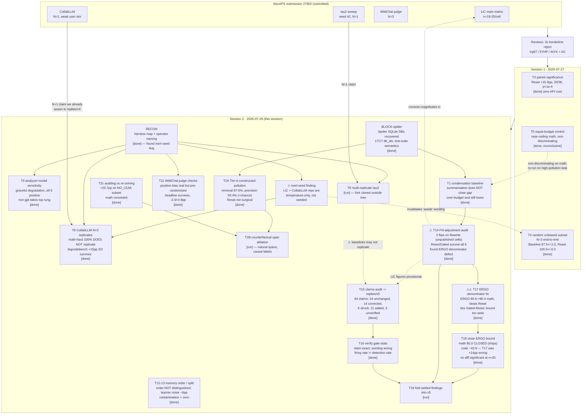

# Provenance Graph — AC3 Experimentation

What was run, in what order, why, and what each run's numbers were used for. This is the "how did we get here" map; the running narrative is in [`WORKLOG.md`](WORKLOG.md).

Conventions: `[done]` result in hand · `[run]` executing · `[todo]` planned · `[blocked]` waiting on a dependency · `[dead]` abandoned, with reason.

---

## Lineage

---

## Run ledger

| ID | Run | Date | Config / artifact | Feeds |
|----|-----|------|-------------------|-------|
| T3 | Paired significance across LiC matrix | 2026-07-27 | `neurips_review/experiments/paired_analysis.py`, `paired_analysis_results.txt` | General Response; AC reply |
| T4 | Random unbiased subset, end-to-end N=3 | 2026-07-27 | `neurips_review/experiments/exp1_reps_results.txt`; `data/rebuttal_random_math40.json`; `outputs/rebuttal_random/` | iNYK Q1 |
| T5 | Equal-budget reflection control | 2026-07-27 | `neurips_review/experiments/exp2_results.txt` | Vg97 Q3 (compute half) |
| BLOCK-spider | Spider DB acquisition | 2026-07-29 | `tasks/BLOCK-spider/worklog.md`; `data/spider/databases/` (4.9 GB, gitignored) | T1, T2A, T5-redo |
| RECON | Harness / naming map | 2026-07-29 | `tasks/RECON/worklog.md` | T8, T9, T6, T11 |
| T2c | Auditing vs. re-solving | 2026-07-29 | `tasks/T2c/worklog.md`, `tasks/T2c/RESULTS.md`; source traces `~/ac3/recovered_t2c/` | 5YHP mechanism challenge — **+20.7pp on leak-free subset**, math conceded |
| T9 | Analyzer-model sensitivity | 2026-07-29 | `tasks/T9/worklog.md` | Vg97 Q3 (unanswered half) |
| T12/T13 | Memory order-sensitivity + split | 2026-07-29 | `tasks/T12-T13/worklog.md` §9 | 5YHP W6 — **contamination zero (helps)**; memory gains below noise floor (hurts) |
| T1 | Condensation baseline | 2026-07-29 | `tasks/T1/worklog.md` | Vg97 W1/Q1 + **AC "limited baselines"** |
| T8 | CollabLLM 3 replicates | 2026-07-29 | `tasks/T8/worklog.md` | 5YHP — **math-hard 100% struck**; bigcodebench +15pp 3/3 + disjoint draw |
| T2A | Tier-A constructed pollution | 2026-07-29 | `tasks/T2A/worklog.md` | 5YHP W5 detector story |
| T9 | Analyzer-model sensitivity | 2026-07-29 | `tasks/T9/worklog.md` (`1f4f32d`) | Vg97 Q3 — **graceful degradation, +12.9 to +39.9 pp across 5 analyzers** |
| T6 | Multi-replicate tau2 | 2026-07-29 | `tasks/T6/worklog.md`; fork at `~/ac3/tau2_ctxe` | iNYK — largest remaining statistical hole |
| T2A | Tier-A constructed pollution | 2026-07-29 | `tasks/T2A/{RESULTS.md,inject.py,measure.py}` (`88cacb3`); `outputs/T2A/` | 5YHP W5 — **detection 97.6% / naming 78.6%; selectivity at chance for Reset** |
| T11 | WildChat judge checks | 2026-07-29 | `tasks/T11/worklog.md` | 5YHP W4 (promised in replies/v4) |
| T1 | Condensation baseline | 2026-07-29 | `tasks/T1/{worklog.md,RESULTS.md,analyze.py}`; `outputs/T1/` | Vg97 W1/Q1 + AC — **summarisation −2.8 to −8.4 pp vs AC3-Reset +19.6 pp** |
| T14 | FN-adjustment audit | 2026-07-29 | `tasks/T14/worklog.md` | **Corrects the paper's headline LiC magnitudes** |
| T11 | WildChat judge checks | 2026-07-29 | `tasks/T11/{worklog.md,out/}` | 5YHP W4 — bias real but pre-randomised; corrected 87.8 / 91.2 |
| T15 | Claims audit → `replies/v5/` | 2026-07-29 | `replies/v5/{CHANGES.md,README.md}` (`5775f71`); `tasks/T15/worklog.md` | Lands F1–F33 in the submitted text; **found F34/F36/F37** |
| T16 | Verify gate statistics | 2026-07-29 | `tasks/T16/{worklog.md,gate_stats.py,report.md}` (`8d545ff`) | F38/F39 — claim exact, wording corrected in v5 (`e889c17`) |
| T2B | Counterfactual span ablation | 2026-07-29 | `tasks/T2B/worklog.md` | Upgrades T2A's synthetic injections to **natural** spans |
| T14 | FN-adjustment audit | 2026-07-29 | `tasks/T14/{RESULTS.md,corrected_matrix.*}` (`30089f3`) | **`tab:main` pool filter is sound; per-run `adjusted_accuracy` must go; ERGO denominators wrong** |
| T17 | ERGO denominator fix | 2026-07-29 | `tasks/T17/{RESULTS.md,build_corrected.py,corrected_tabmain.json}` (`6ebc59b`) | **PAPER-7 — ERGO ties/beats AC3 on 3 of 4 tasks once corrected** |
| T18 | Close the ERGO bound | 2026-07-29 | `tasks/T18/worklog.md` | **math 80.0 confirmed; code ~43.9 (T17 overstated by 14 pp); nothing significant at n≈20** |
| T19 | Fold settled findings into `replies/v5/` | 2026-07-29 | `tasks/T19/worklog.md`; `replies/v5/CHANGES.md` | Lands T14/T16/T17/T18 in the reply text |

---

## Dead ends and why

| Direction | Verdict | Reason |
|---|---|---|
| "BigCodeBench cannot be evaluated with executable tests" | `[dead]` | Factually wrong — T8 §5 shows that path runs real `untrusted_check` execution. We conceded a limitation that does not exist; struck along with the dependent judge-discrimination figures. |
| "AC3 beats ERGO across LiC" (as an unqualified claim) | `[dead]` | Corrected denominators: ERGO/math 80.0 beats AC3-Reset (75.0) and ties Gated-Reset. **Superseded in part by T18** — see next row. |
| T17's corrected ERGO/code = 57.9 | `[dead]` | T18 measured the free parameter k directly (2.67/6, not 0/6): corrected ERGO/code is ~43.9 ≈ the published 44.0. Shipping 57.9 would have overstated a competitor by 14 pp. Measured scorecard 3/12, not 7/12. |
| Framing the ERGO comparison as an ordering at all | `[dead]` | T18: paired exact sign tests show **no** ERGO-vs-AC3 `tab:main` difference is significant at n≈20 in either direction (code p=0.375, math p=1.00). Report "n≈20 cannot resolve this" rather than any ordering. |
| Per-run `adjusted_accuracy` as a reported metric | `[dead]` | T14: inflates reset arms +13.9 to +55.9 pp vs +0.2 to +6.5 for no-reset arms, because the FN judge sees 1.00 user turns/sample on Rewrite vs 5.35 on baseline. Report **raw**; keep only the arm-symmetric pool filter. |
| Rebuttal end-to-end "AC3-Reset 100.0 ± 0.0" | `[dead]` | FN-adjusted with asymmetric exclusions (Reset 1/2/5 items, baseline 0). Raw: 87.5 ± 2.0 / 93.3 ± 4.2 / 95.0 ± 0.0. Claim survives; the perfect score does not. |
| MT-OSC as a fair pollution baseline | `[dead]` | T1: at published w=4 it fired 0.3×/conversation — it cannot touch context before turn 6 and LiC conversations average 4.1 turns. Report as *structurally inapplicable*, which supports our scoping argument, rather than as a beaten baseline. |
| End-to-end tau2 replay | `[dead]` | ~2 dev-days; out of window. Defend replay as causal-attribution design instead; T4 supplies fresh end-to-end evidence on LiC. |
| Full human eval on WildChat | `[dead]` | Out of window. Defend with N=3 seeds + tight intervals; T11 supplies judge-side checks. |
| T5 on math | `[dead]` as a discriminating control | Near-ceiling accuracy compressed all arms to ~97.5%. Needs a high-pollution venue → folded into T1. |
| Quoting single-trial memory gains (+10/+12 pp) | `[dead]` | T12: below the learner's own ~6 pp noise floor; N=4 remeasure gives −5.0/−8.0 pp. Lead with T13's zero-contamination result instead (D7). |
| "We preserve what's correct and remove what's harmful" (as a claim about **Reset**) | `[dead]` | T2A: edit precision 50.4% vs 50% chance, preservation 4.0%. Reset discards the assistant side wholesale and re-derives from the user side. The selectivity claim belongs to **Rewrite** (27.0 / 38.9). Attribute, don't retract. |
| `analysis_cache` as a T9 confound | `[dead]` | Resolved, not worked around: `make_key()` includes analyzer model identity (`analysis_cache.py:92`); call site passes live model (`analyzer.py:587`). Cache disabled anyway + per-trace audit. |
| CollabLLM math-hard "100%" claim | `[dead]` | T8 N=3: 91.7 ± 7.6 vs Baseline 91.7 ± 5.8, identical 55/60 totals. Near-ceiling decoding noise. Say "matches Baseline" — still refutes the regression. |
| "Memory is order-robust" framing | `[dead]` | T12 variance controls: across-ordering std (6.5) does not exceed same-ordering std (6.1). Ordering is not a distinguished factor; the learner is just noisy. |
