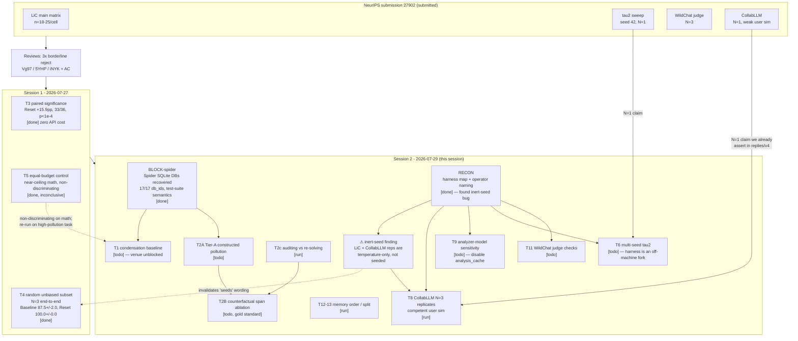

# Provenance Graph — AC3 Experimentation

What was run, in what order, why, and what each run's numbers were used for. This is the "how did we get here" map; the running narrative is in [`WORKLOG.md`](WORKLOG.md).

Conventions: `[done]` result in hand · `[run]` executing · `[todo]` planned · `[blocked]` waiting on a dependency · `[dead]` abandoned, with reason.

---

## Lineage

---

## Run ledger

| ID | Run | Date | Config / artifact | Feeds |
|----|-----|------|-------------------|-------|
| T3 | Paired significance across LiC matrix | 2026-07-27 | `neurips_review/experiments/paired_analysis.py`, `paired_analysis_results.txt` | General Response; AC reply |
| T4 | Random unbiased subset, end-to-end N=3 | 2026-07-27 | `neurips_review/experiments/exp1_reps_results.txt`; `data/rebuttal_random_math40.json`; `outputs/rebuttal_random/` | iNYK Q1 |
| T5 | Equal-budget reflection control | 2026-07-27 | `neurips_review/experiments/exp2_results.txt` | Vg97 Q3 (compute half) |
| BLOCK-spider | Spider DB acquisition | 2026-07-29 | `tasks/BLOCK-spider/worklog.md`; `data/spider/databases/` (4.9 GB, gitignored) | T1, T2A, T5-redo |
| RECON | Harness / naming map | 2026-07-29 | `tasks/RECON/worklog.md` | T8, T9, T6, T11 |
| T2c | Auditing vs. re-solving | 2026-07-29 | `tasks/T2c/worklog.md` | 5YHP mechanism challenge |

---

## Dead ends and why

| Direction | Verdict | Reason |
|---|---|---|
| End-to-end tau2 replay | `[dead]` | ~2 dev-days; out of window. Defend replay as causal-attribution design instead; T4 supplies fresh end-to-end evidence on LiC. |
| Full human eval on WildChat | `[dead]` | Out of window. Defend with N=3 seeds + tight intervals; T11 supplies judge-side checks. |
| T5 on math | `[dead]` as a discriminating control | Near-ceiling accuracy compressed all arms to ~97.5%. Needs a high-pollution venue → folded into T1. |
